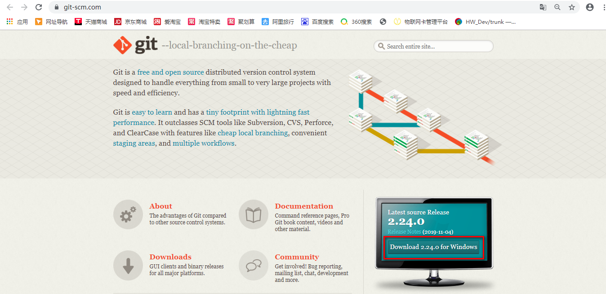
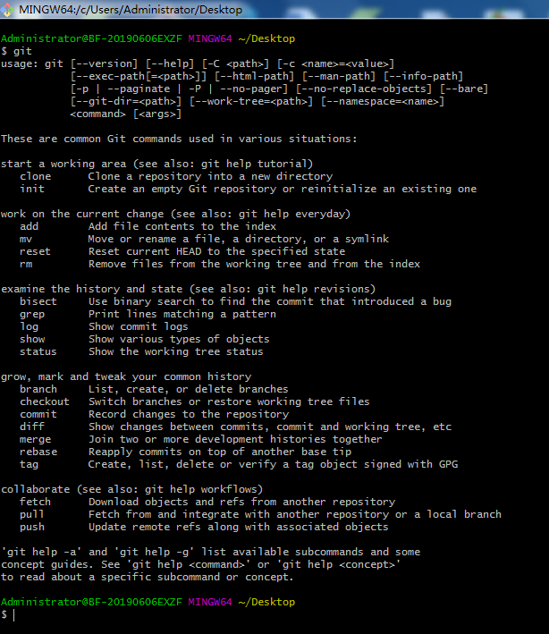

#Git操作指南
##1.使用Github
1）注册个人github账号。
(www.github.com)
2）创建仓库。
点击New


填入必要信息


创建仓库成功


##2.使用Git
###安装Git客户端


下载对应的版本，并安装。
###使用GitBash
任意目录右键，选择Git Bash Here
输入git，查看git相关命令


####克隆仓库
```git
git clone https://github.com/laiyipan/array_demo.git
```


####初始化仓库 ：Git init
```git
git init
```
####配置仓库：
```git
git config --global user.name "ASxx"
git config --global user.email "123456789@qq.com" 
```
在 vs 中每次更新代码都会要输入账号密码，可以配置一下让 GIT 记住密码账号（非必须）：
```git
git config --global credential.helper store
```


##3.在VSCode中使用Git
前提：已安装VSCode
###打开工程文件夹


原因在于当前的github 账号是ClimbSong，不是laiyipan，如下图：
```git
git config user.name
```
```git
git config user.email
```
```git
$ git config --list
```

切换当前github账号：

```git
git config --global user.name "laiyipan"
git config --global user.email "345075153@qq.com" 
```

在vscode中，继续push，仍然denied。
需删除已经有的github管理凭证：

在vscode中，继续push，弹出：

输入对应的账号及密码，Push成功。
新的管理凭证产生


根目录增加新的文件夹：
Array/array.c
Basic/hello.c
note.txt
随后，commit，push。

###使用GitLens查看日志
前提：安装了GitLens插件。
点击①，进入GitLens.点击②，把光标移动到第5行。
>GitLens是VScode插件，比VScode自带的Source Control功能要更强大。


区域③显示当前文件array.c的历史日志
区域④显示当前文件当前行的历史日志。

如下图，点击①Copy Commit ID to Clipboard，到②Terminal,输入如下：
```git
git log --name-only -n1 08c5175f27e29cfdc2dbcb4d7637e2db2fd24871
```

展现了本次Commit的信息

再次修改array.c,增加注释，如下图

commit后，push，注意观察左侧展示的History

###使用 Git History


##4.其他功能